# Hayate (疾風)

Hayate is a high-performance, secure, and zero-allocation cross-device CLI file transfer utility written in Go. Engineered with mechanical sympathy, it utilizes a custom-built parallel pipeline combining real-time **zstd compression** with **ChaCha20-Poly1305 AEAD** encryption, streamed over multiplexed **QUIC (UDP)** transport.

```text
    __ __                 __    
   / // /___ ___ __ ___ _/ /____
  / _  / _ \'/ // / _ \'/ __/ -_)
 /_//_/\_,_/\_, /\_,_/\__/\___/ 
           /___/                
```

---

## Key Features

* **Zero-Allocation Cryptography**: Utilizes ephemeral X25519 Curve25519 ECDH handshakes for session key agreement. Payload encryption is executed in-place directly into recycled buffers, bypassing heap allocations on the hot path.
* **Multiplexed UDP Transport**: Bypasses TCP congestion overheads using `quic-go`, securing connections with short-lived TLS configurations generated purely in-memory.
* **Real-time Compressed Sharding**: Implements real-time parallel zstd compression (`klauspost/compress/zstd`) aligned to your CPU core topology.
* **Resilient Peer Discovery**: Scans local networks using multicast DNS (mDNS). Features a graceful fallback to direct IP transfers on restricted mobile environments (like Android Termux) where UDP multicast is blocked.
* **Gorgeous ASCII TUI**: A highly polished, emoji-free Terminal User Interface powered by Charm Bracelet (`bubbletea` and `lipgloss`) utilizing HSL hex palettes designed for dark modes.
* **Headless/Pipeline Friendly**: Automatically detects non-TTY environments (e.g., standard streams, cron, SSH scripts) and falls back to a clean plain-text progress layout.

---

## Architecture Overview

```mermaid
sequenceDiagram
    autonumber
    participant Sender as Hayate (Sender)
    participant Receiver as Hayate (Receiver)
    
    Note over Sender,Receiver: Ephemeral ECDH Key Exchange & Handshake
    Sender->>Receiver: Write Ephemeral X25519 Public Key (32B)
    Receiver->>Sender: Write Ephemeral X25519 Public Key (32B)
    Note over Sender: Derive Session Key
    Note over Receiver: Derive Session Key
    
    Note over Sender,Receiver: Secure Metadata Exchange
    Sender->>Receiver: Encrypted Metadata Packet (Filename, Raw Size)
    
    Note over Sender,Receiver: High-Throughput Pipeline (1MB Chunks)
    rect rgb(30, 30, 46)
        Note over Sender: Read file -> Compress (zstd) -> Encrypt (ChaCha20-Poly1305)
        Sender->>Receiver: Write [Length Frame (4B)] + [Encrypted Chunk Payload]
        Note over Receiver: Decrypt (In-place) -> Decompress -> Write to Disk
    end
    
    Note over Sender,Receiver: Socket Close & Completion Sync
    Sender->>Receiver: stream.Close() (FIN)
    Note over Receiver: Calculate Final SHA-256 Hash
    Receiver->>Sender: stream.Close() (FIN)
    Note over Sender: Unblocks dummy read & exit
```



---

## Installation & Releases

Download the complete pre-compiled static releases package:

* **Archive Download**: [hayate-releases.zip](file:///Users/saksham/Projects/Hayate/hayate-releases.zip)

### SHA-256 Checksums

To verify the integrity of your download:

```text
a80aa3bb4ba98fe5e8b9df6ebf794920dceee53d08deab4c195278544a582226  hayate-releases.zip
d2bb77ddc30c46925adb8ef8cb16d36cc41329a7a5ec7fdeccd473520f85f220  hayate-android-arm64
359cd59b447fdeb0e9170da977470c085a387ec2cbf4ac2be9a45e2bc7399174  hayate-darwin-arm64
bd8acffaab7b4aadbc1dd5d3f7f37074e246375dcee5f0295d926340d3a85394  hayate-darwin-amd64
570250e38ef436d1fb7c6fcf8d6214104ff745b74484d2d809f33e89d060cee1  hayate-linux-amd64
ae455db2ee9a19a2a5441adb5797318ab706a32ae33a8876799b8bc3a9ca118e  hayate-linux-arm64
```

---

## Usage Guide

### 1. Receive Mode (Listening for Files)
Binds to a port and waits for incoming file transfers. 

```bash
# Launch interactive TUI receiver
./hayate-darwin-arm64 receive --port 50001

# Launch plain-text headless receiver (recommended for Termux/Scripts)
./hayate-android-arm64 receive --port 50001 --no-tui
```

*When the receiver launches, it prints its local IP address and port (e.g. `192.168.1.3:50001`). Copy this address for the sender.*

### 2. Send Mode (Transmitting Files)
Encrypts, compresses, and transmits a file.

```bash
# Send a file utilizing local mDNS peer discovery
./hayate-darwin-arm64 send my_archive.tar.gz

# Send a file directly by bypassing discovery (bypasses mDNS interface limits)
./hayate-darwin-arm64 send --peer 192.168.1.3:50001 my_archive.tar.gz

# Send a file in plain-text headless mode
./hayate-darwin-arm64 send --peer 192.168.1.3:50001 --no-tui my_archive.tar.gz
```

### 3. Discover Mode (Network Scan)
Queries the local multicast DNS subnet for other active Hayate peers.

```bash
./hayate-darwin-arm64 discover --duration 5s
```

---

## Performance Tuning Details

Hayate is optimized for high-bandwidth local connections (Wi-Fi 6, 10Gbps Ethernet, loopback):
1. **Memory Allocation**: Custom read buffers (1MB chunks) are pooled via `sync.Pool`. Memory pressure is nearly static, keeping Go GC pauses to under 1ms.
2. **CPU Sympathy**: Encryption and compression worker thread pools are sized explicitly to system core topology, with `zstd` limited to single-thread scaling per chunk to avoid thread-oversubscription lock contention.
3. **Pipeline Synchronization**: Uses cooperative FIN-stream handshakes to prevent socket teardown before the receiver has successfully flushed chunks to storage.

---

## Building from Source

Ensure you have **Go 1.22+** installed:

```bash
# Clone the repository
git clone https://github.com/shiinasaku/hayate.git && cd hayate

# Run unit tests
go test -v -race ./...

# Compile optimized static release binaries
CGO_ENABLED=0 go build -ldflags="-s -w" -o hayate ./cmd/hayate
```
